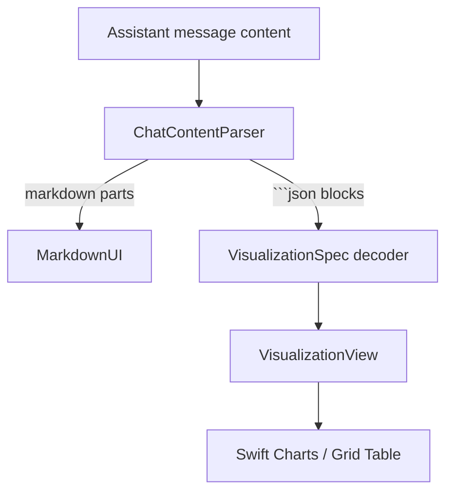
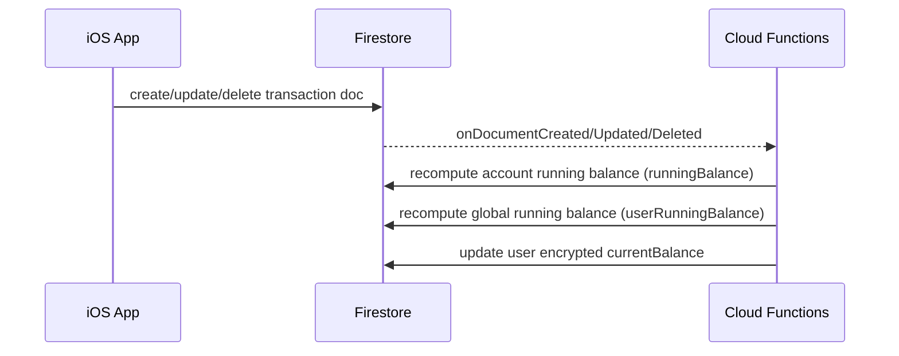
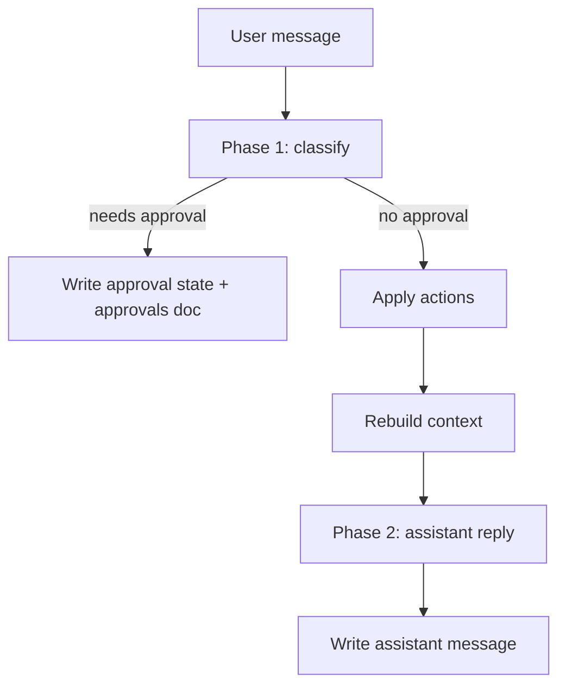

# Budge iOS App

Budge is a SwiftUI iOS app that combines **personal finance tracking** (accounts, transactions, budgets, reminders) with an **AI finance assistant** (Ask / Agent / Plan chat modes). The iOS app uses **Firestore** for data, **Cloud Functions** for privileged logic (encryption, derived balances, chat pipeline), and modern SwiftUI architecture.

This README is **iOS-app specific**.

## Requirements

- **iOS 17.0+**
- **Xcode 15+**
- **Swift 5.9+**

## Tech stack

- **UI**: SwiftUI
- **Charts**: Swift Charts (`Charts`)
- **Markdown**: `MarkdownUI`
- **Auth**: Firebase Auth + Google Sign-In
- **Data**: Firestore, Firebase Storage
- **Backend**: Firebase Cloud Functions (Gen2) + Firestore triggers
- **Push plumbing (optional)**: Firebase Messaging + APNs (paid Apple Developer program required for real remote push)
- **State**: MVVM with `@Observable`
- **Navigation**: `Router` + `Route`
- **Build system**: XcodeGen (`ios/Budge/project.yml`)

## Features (iOS)

- **Chat**
  - **Ask mode**: read-only Q&A and advice
  - **Agent mode**: executes finance operations + approvals when required
  - **Plan mode**: long-form planning output, tables + visualizations
- **Balance sheet / chart**
  - Transactions table with **account running balance** + **global user-currency running balance**
  - Create/edit transaction sheets (account picker + filtered categories)
- **My Accounts**
  - Create/update/rename, bulk selection + delete
  - Default “Main Account” deletion is blocked in UI
- **My Reminders**
  - Create/edit + bulk delete, pagination + empty states
- **Chat visualizations**
  - Parses ` ```json ... ``` ` blocks into Swift Charts + tables
  - Multiple charts per assistant message
  - Tap/selection shows underlying values
- **Realtime header balance**
  - Updates without leaving the screen when server recomputes balances

## Project structure

```text
ios/
  Budge/                 # XcodeGen project (project.yml, assets, Info.plist)
  Boilerplate/           # App code (features + shared)
  BoilerplateTests/      # Unit tests
  tools/xcodegen/        # XcodeGen pinned binary
```

Inside `ios/Boilerplate/`:

```text
App/                    # App entry point, Firebase delegate, DI wiring
Core/                   # Infra services (AuthService, OnboardingService, Router, logging)
Features/               # Feature modules (Chat, Chart, Accounts, Reminders, Settings, Onboarding)
Shared/                 # Reusable UI + styles + extensions + components
```

## Architecture (high level)

### Rendering assistant replies (Markdown + charts/tables)



Notes:

- The parser expects fenced blocks: ` ```json { ... } ``` `
- Table decoding supports both schemas:
  - `columns: [{ key, label }]` + `rows: [{ key: value }]`
  - `columns: ["A","B"]` + `rows: [["..",".."]]`

### Data flow (transactions → derived balances)



### Chat pipeline (Agent mode)



## Firestore model (high level)

- `users/{uid}`
  - `currency`
  - encrypted `startingBalance`, encrypted `currentBalance`
  - `defaultAccountId`
  - `accounts/{accountId}` (soft delete via `isActive=false`)
- `transactions/{uid}/userTransactions/{txId}`
  - per-account `runningBalance`
  - global `userRunningBalance` (user currency)
- `financialTypes/{uid}/{income|expense}/{key}`
- `budget/{uid}/{income|expense}/{year}/{key}/aggregate`
- `reminders/{uid}/userReminders/{reminderId}`
- `chats/{uid}/userChats/{chatId}` + subcollections `messages`, `approvals`

## Backend decisions (Cloud Functions)

- **Encryption**: finance fields are encrypted server-side (KMS + per-user DEK).
- **Derived fields**: running balances + aggregates are recomputed on the server for consistency.
- **Chat pipeline**: LLM calls + action application happen server-side so clients stay thin.

### Active accounts only in LLM context

Accounts are “deleted” by setting `isActive = false`. Only active accounts should be included when building the LLM context.

## Development

### Generate Xcode project

```bash
cd ios/Budge
./../tools/xcodegen/xcodegen/bin/xcodegen generate --spec project.yml
open Budge.xcodeproj
```

### Build (CLI)

```bash
cd ios/Budge
xcodebuild -scheme Budge -destination "platform=iOS Simulator,name=iPhone 16" CODE_SIGNING_ALLOWED=NO build
```

## Troubleshooting

- **Charts/tables show raw JSON**: the visualization JSON failed to decode (wrong fence or unsupported schema).
- **Chat stuck on “Thinking…”**: backend Phase-2 reply failed before writing an assistant message; check Functions logs and ensure deployed code is current.
